# Chat Application Backend

A real-time chat application backend built with Python and FastAPI.

## Overview

This project implements a backend for a real-time chat application using FastAPI, SQLModel for ORM, PostgreSQL for database, and JWT for authentication.

## Task 1: Environment & Dependencies Setup

### Prerequisites
- Python 3.10+
- PostgreSQL
- Git

### Setup Instructions

1. **Clone the repository** (if not already done):
   ```bash
   git clone <repository-url>
   cd ChatApplication
   ```

2. **Create virtual environment**:
   ```bash
   python -m venv venv
   ```

3. **Activate the virtual environment**:
   - On Windows:
     ```bash
     venv\Scripts\activate
     ```
   - On macOS/Linux:
     ```bash
     source venv/bin/activate
     ```

4. **Install dependencies**:
   ```bash
   pip install -r requirements.txt
   ```

### Dependencies
The following packages are pinned in `requirements.txt`:
pip install -r requirement.txt

### Running the Application
To start the development server:
```bash
uvicorn app.main:app --reload
```

The API will be available at `http://127.0.0.1:8000`

### API Endpoints
- `GET /` - Root endpoint
- `GET /health` - Health check endpoint

### Project Structure
```
ChatApplication/
├── app/
│   ├── __init__.py
│   └── main.py          # FastAPI application
├── venv/                # Virtual environment
├── requirements.txt     # Dependencies
└── README.md           # This file
```# Chat Application Backend

## Screenshots

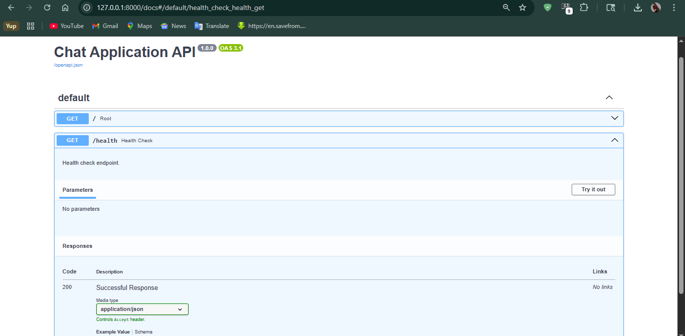
*Screenshot of the FastAPI app running with uvicorn.*

## Task 2: JWT Authentication & Role-Based Access Control (RBAC)

### Overview
Implemented JWT-based authentication with role-based access control using FastAPI dependencies. Users can register with a role, log in to receive a signed token, and access protected routes based on that role.

### User Model
The `User` model includes:
- `id`
- `username`
- `email`
- `hashed_password`
- `role`

Supported roles:
- `admin`
- `user`

Passwords are stored only as hashed values, never in plain text.

### Authentication Endpoints

#### `POST /auth/signup`
Creates a new user with a hashed password and assigned role.

**Request Body**
```json
{
  "username": "admin2",
  "email": "admin2@example.com",
  "password": "adminpass123",
  "role": "admin"
}
```

**Successful Response**
```json
{
  "id": 1,
  "username": "admin2",
  "email": "admin2@example.com",
  "role": "admin"
}
```

#### `POST /auth/login`
Authenticates a user and returns a JWT access token.

**Form Data**
```text
username=admin2
password=adminpass123
```

**Successful Response**
```json
{
  "access_token": "eyJhbGciOiJIUzI1NiIs...",
  "token_type": "bearer"
}
```

### JWT Details
- **Signing Algorithm:** `HS256`
- **Expiry:** Included in the token payload
- **Payload Fields:** `sub`, `role`, `exp`

Example payload:
```json
{
  "sub": "admin2",
  "role": "admin",
  "exp": 1776829485
}
```

### RBAC Dependency
Role checks are enforced using reusable dependencies in `app/dependencies.py`.

```python
def require_role(required_role: UserRole):
    def role_checker(current_user: User = Depends(get_current_user)):
        if current_user.role != required_role:
            raise HTTPException(
                status_code=status.HTTP_403_FORBIDDEN,
                detail="Not enough permissions"
            )
        return current_user
    return role_checker

require_admin = require_role(UserRole.ADMIN)
```

### Demonstrated Protected Route
The RBAC dependency is used on this protected route in `app/main.py`:

```python
@app.get("/protected/admin")
async def admin_only(current_user: User = Depends(require_admin)):
    return {"message": f"Hello {current_user.username}, you are an admin!"}
```

This demonstrates the deliverable requirement of a reusable RBAC dependency used on a protected route.

### How Task 2 Was Tested

#### 1. Signup test
Used Swagger UI at `http://127.0.0.1:8000/docs` to call:

- `POST /auth/signup`

Example test body:
```json
{
  "username": "admin2",
  "email": "admin2@example.com",
  "password": "adminpass123",
  "role": "admin"
}
```

Expected result:
- user created successfully
- response returns `id`, `username`, `email`, and `role`

#### 2. Login test
Used Swagger UI to call:

- `POST /auth/login`

Example credentials:
```text
username: admin2
password: adminpass123
```

Expected result:
- HTTP `200 OK`
- JWT token returned in `access_token`

#### 3. Authenticated route test
Used the token returned by `/auth/login` and authenticated in Swagger using the **raw token only**.

Important:
- paste only the JWT token into Swagger Authorize
- do **not** type `Bearer ` manually, because Swagger adds it automatically

Then tested:
- `GET /protected/user` → should return `200 OK`
- `GET /protected/admin` → should return `200 OK` for admin users

#### 4. RBAC verification
The `require_admin` dependency protects `GET /protected/admin`.

Expected behavior:
- admin token → `200 OK`
- normal user token → `403 Forbidden`

### Deliverable
**Working `/signup` and `/login` endpoints, and a demonstrated RBAC dependency used on at least one protected route.**

### Task 2 Screenshots
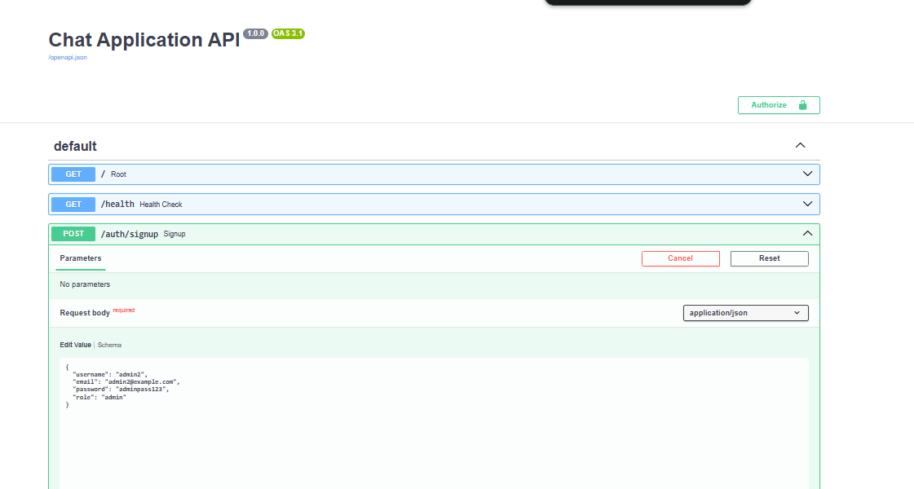

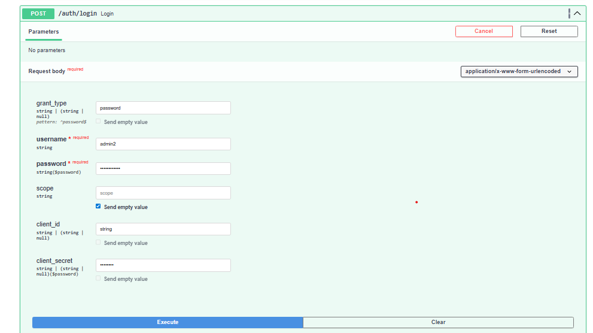

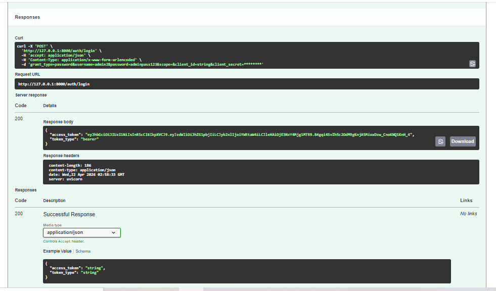

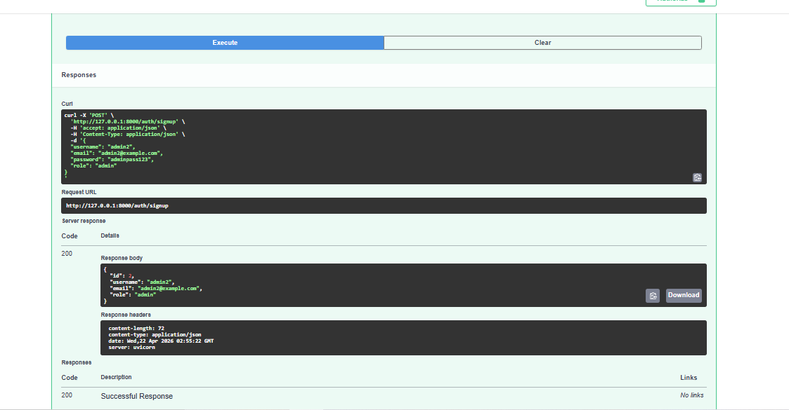

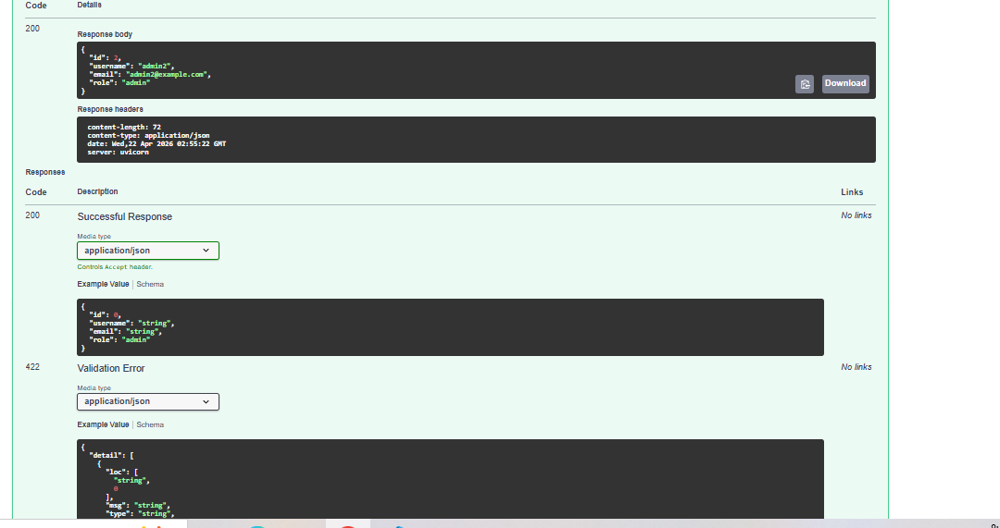

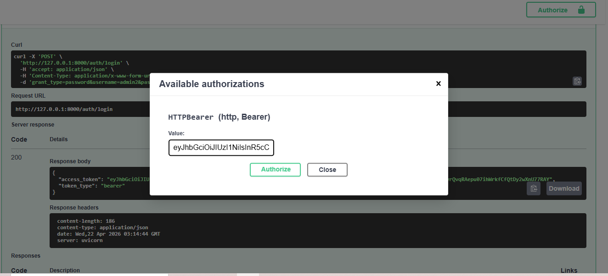

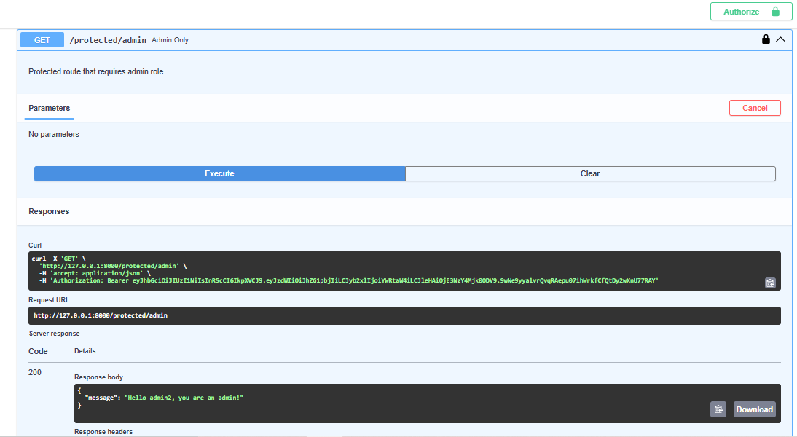

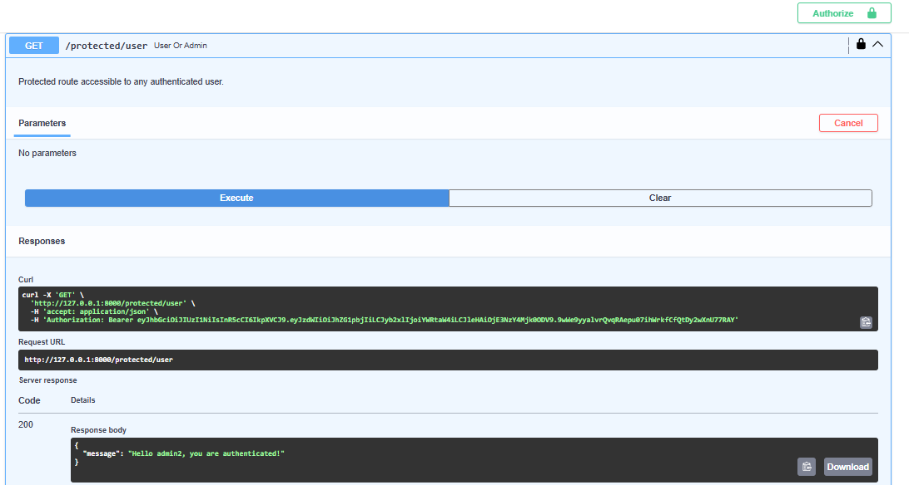

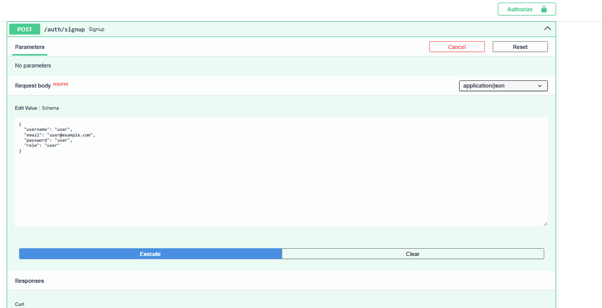

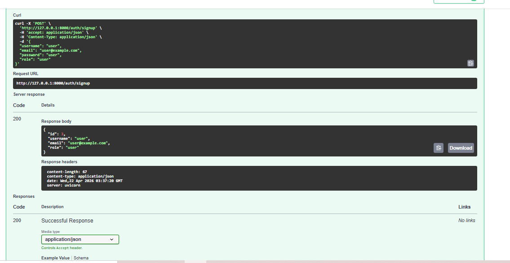

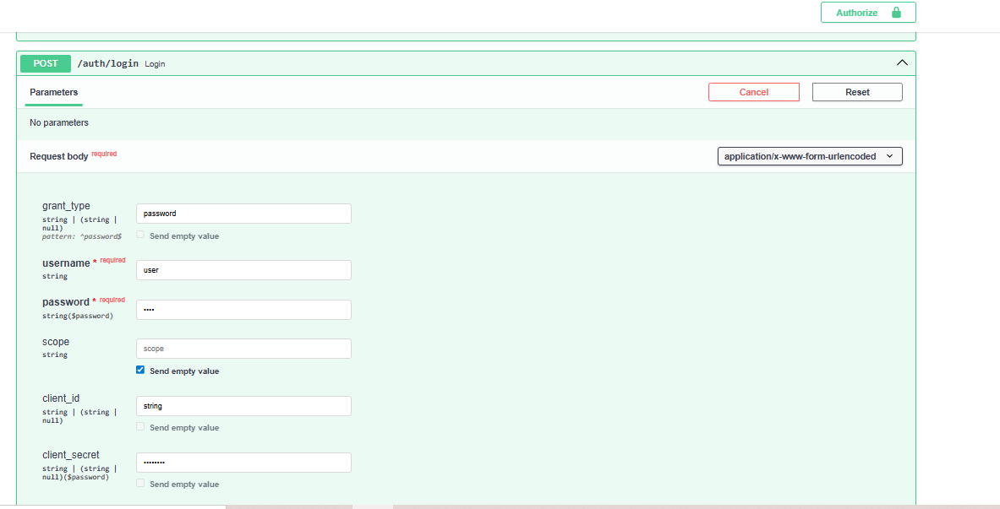

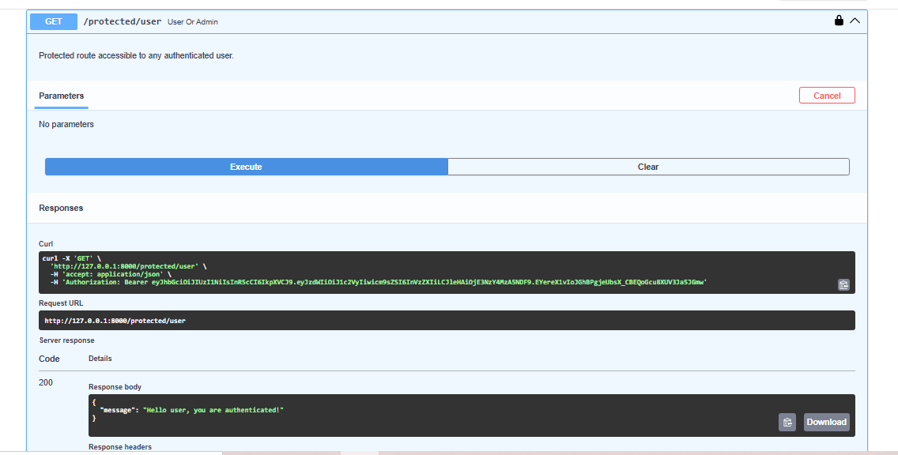

## Task 3: Protected WebSocket Chat

### Overview
Implemented a JWT-protected WebSocket chat system with support for multiple rooms, multiple connected clients, persisted messages, and room history loading on connection.

### WebSocket Endpoint

#### `WS /ws/{room_id}`
This is the protected real-time chat endpoint.

**Query Parameters**
- `token` — required JWT token
- `cursor` — optional cursor for older message history
- `limit` — optional number of history messages to return on connect

### Implemented Behavior

#### On connection
- validates the JWT token passed as a query parameter
- rejects unauthenticated users
- loads recent messages for the requested room from the database
- sends the room history to the client as an initial payload

Example history payload:
```json
{
  "type": "history",
  "room_id": "general",
  "messages": [
    {
      "id": 1,
      "room_id": "general",
      "user_id": 2,
      "username": "user1",
      "content": "Hello everyone",
      "created_at": "2026-04-22T07:15:00+00:00"
    }
  ],
  "next_cursor": null
}
```

#### On incoming message
- reads the incoming text payload
- accepts plain text or JSON like:
```json
{"content": "hello"}
```
- validates that the message is not empty
- stores the message in the database
- broadcasts the saved message to all connected clients in the same room

Example live message payload:
```json
{
  "type": "message",
  "room_id": "general",
  "message": {
    "id": 2,
    "room_id": "general",
    "user_id": 2,
    "username": "user1",
    "content": "hello",
    "created_at": "2026-04-22T07:16:00+00:00"
  }
}
```

#### On disconnection
- removes the WebSocket from the room connection list
- cleans up gracefully without affecting other rooms

### Multi-Room Support
Connections are tracked separately per room using an in-memory connection manager.

This means:
- users in `general` only receive messages from `general`
- users in `room2` only receive messages from `room2`
- multiple rooms can be active at the same time

### Message Persistence
Messages are stored in the `Message` table with:
- `id`
- `room_id`
- `user_id`
- `username`
- `content`
- `created_at`

This satisfies the persistence requirement for Task 3.

### Browser Tab Demo for Task 3

A browser-based demo page was added at:

#### `GET /task3`

Open:
```text
http://127.0.0.1:8000/task3
```

This page allows you to:
- create users
- log in and obtain a JWT
- connect to `/ws/{room_id}` with the JWT automatically
- open the same page in multiple browser tabs
- test same-room and different-room behavior interactively

### How Task 3 Can Be Tested in Different Browser Tabs

#### Test 1: Same room in two browser tabs
1. Open `http://127.0.0.1:8000/task3` in **Tab 1**
2. Open `http://127.0.0.1:8000/task3` in **Tab 2**
3. Sign up or use two different users
4. Log in in both tabs
5. Use the same room id, for example `general`
6. Click **Connect WebSocket** in both tabs
7. Send a message from Tab 1
8. Confirm the message appears immediately in Tab 2
9. Send a message from Tab 2
10. Confirm the message appears immediately in Tab 1

This demonstrates:
- multi-client real-time chat
- room-based broadcasting
- authenticated WebSocket access

#### Test 2: Different rooms in separate tabs
1. Keep Tab 1 connected to `general`
2. In Tab 2, connect to `room2`
3. Send a message in Tab 1
4. Confirm it does not appear in Tab 2
5. Send a message in Tab 2
6. Confirm it does not appear in Tab 1

This demonstrates:
- simultaneous multi-room support
- correct room isolation

#### Test 3: History loading
1. Send several messages in a room
2. Disconnect both tabs
3. Open a fresh tab and reconnect to the same room
4. Confirm that recent messages are loaded automatically on connection

This demonstrates:
- database persistence
- history retrieval on connect
- cursor-based pagination support

### Security Notes
- WebSocket connections without a valid token are rejected
- JWT validation happens before the client is accepted into the room
- passwords remain hashed and are never stored in plain text

### Deliverable
**A working WebSocket endpoint that supports multi-client, multi-room real-time messaging, JWT-protected access, and persisted message history.**

### Task 3 Screenshots
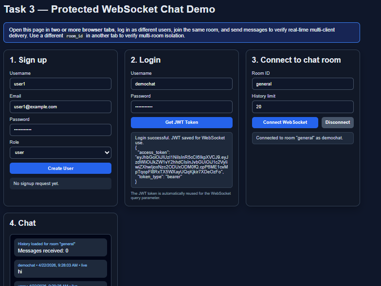

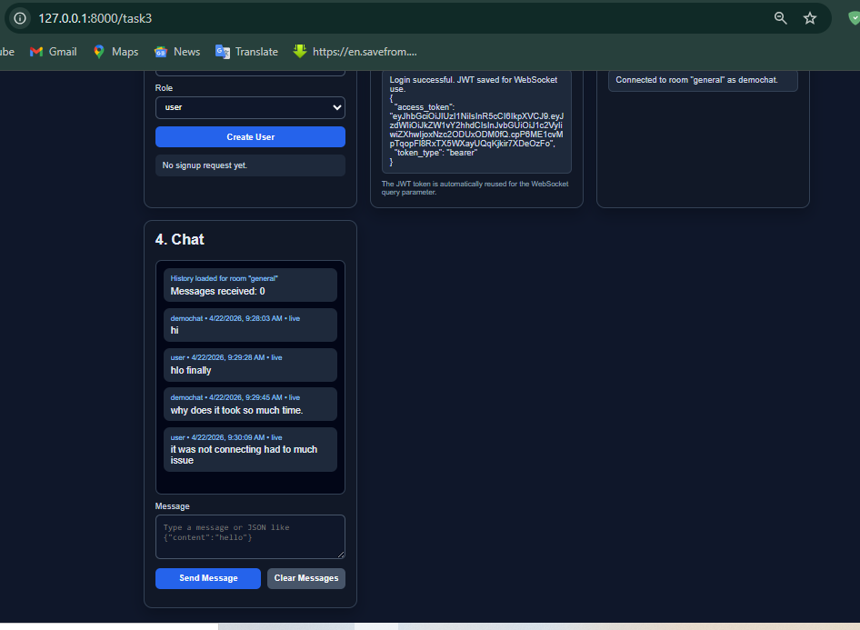

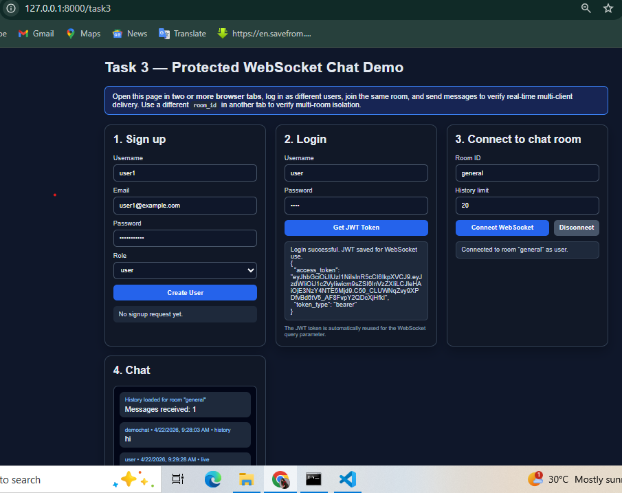

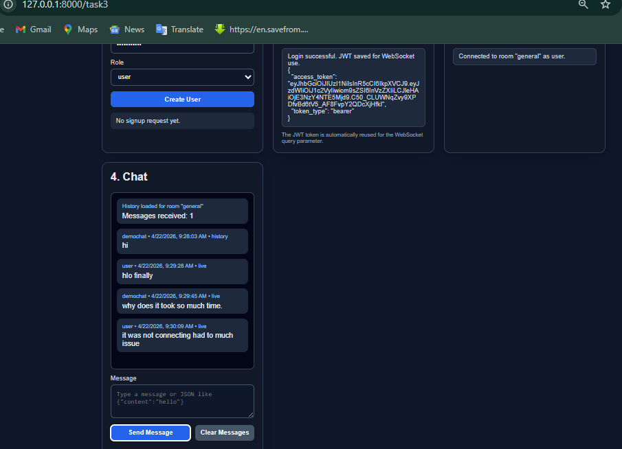

## Group B Task: Rate Limiting

### Chosen Feature
Implemented **per-user message rate limiting** on the protected WebSocket chat endpoint.

### What Was Built
A `MessageRateLimiter` was added in `app/main.py` to control how frequently an authenticated user can send chat messages over the WebSocket connection.

Current limits:
- maximum **5 messages**
- within **10 seconds**
- enforced **per authenticated user**

If a user exceeds the limit, the server does not save or broadcast the message. Instead, it sends a structured response like:

```json
{
  "type": "rate_limit",
  "detail": "Rate limit exceeded. Max 5 messages per 10 seconds.",
  "retry_after_seconds": 4
}
```

### Why This Design Was Chosen
This design was chosen because:
- it is simple and predictable for demonstration purposes
- it prevents obvious message spam without blocking normal chat usage
- it works per user rather than globally, so one noisy client does not throttle everyone else
- it gives the client a `retry_after_seconds` value, which makes the limit easier to handle in the UI

The implementation uses an in-memory `deque` of recent send timestamps per user. Old timestamps outside the 10-second window are removed before each new message is evaluated.

### Where It Is Enforced
Rate limiting is enforced inside the WebSocket message loop in `app/main.py`, after the user is authenticated and before a message is written to the database or broadcast to the room.

### Deliverable
**Working rate limiting on the WebSocket endpoint, with a brief explanation of what was built and why those design choices were made.**
